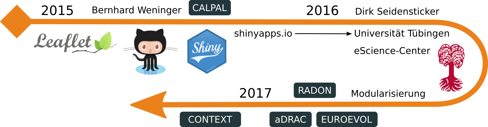
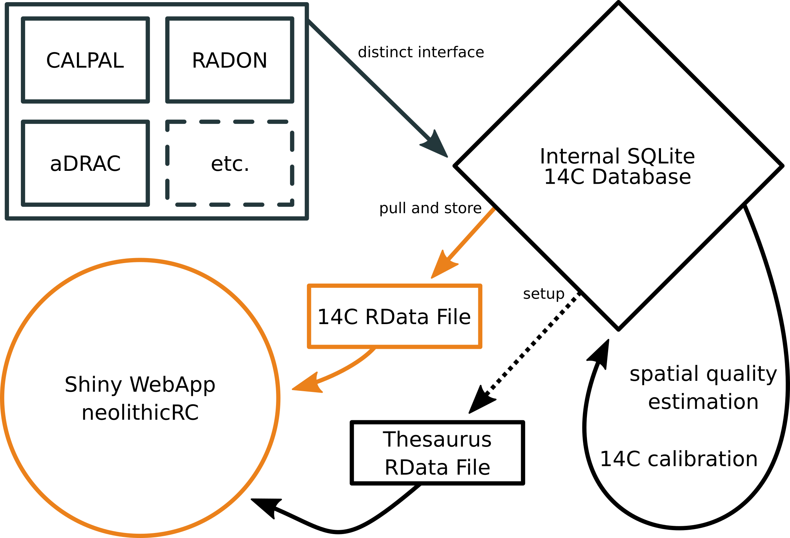

# OpenAccess - OpenData - OpenScience

## *Radiocarbon datings*


## *Radiocarbon datings*

- Bedeutung von Radiokohlenstoffdatierungen für Modellierung der Ausbreitung archäologischer Phänomene
- Faktoren für den Diskurs:
    - Datenbestand
    - Algorithmus


## *Radiocarbon datings*


## *Best practice*: Archives des datations radiocarbone d'Afrique centrale

* OpenData-Veröffentlichung von publizierten 14C-Datierungen aus Zentralafrika (DOI 10.5281/zenodo.61113)


## *Best practice*: Archives des datations radiocarbone d'Afrique centrale


## *Best practice*: Archives des datations radiocarbone d'Afrique centrale


## *Best practice*: Archives des datations radiocarbone d'Afrique centrale


## *Best practice*: Archives des datations radiocarbone d'Afrique centrale


<!--
## Interfaces


-->
 
## *Parsing the Past*


> “Building a database, per se, will be a thing of the past. Those databases will be dynamically generated based on the questions you’re interested in, and the machine will do the heavy lifting.” Shanan Peters (Univ. Wisconsin-Madison; Callaway 2015: 115)

# neolithicRC

## Projektkontext



- **DIY Freizeit- und Übungsprojekt** ohne institutionelle Anbindung
- intensiver Austausch mit den Teams hinter CALPAL und RADON
- strukturelle Anbindung an das eScience-Center der Universität Tübingen
- **Warum machen wir das?**
    - Technische Weiterentwicklung eines Werkzeugs
    - Verstehen von Datenverarbeitungs- und Datenhaltungsproblemen
    - Kommunizieren von zeitgemäßen Lösungsansätzen

## Projektkonzept

### Entwicklungsumgebung 

- **R + RStudio:** Einfache Programmiersprache mit riesigem Funktionsumfang in einer optimierten IDE
- **shiny + htmlwidgets:** WebApp-Framework und R-JavaScript Interfaces zur interaktiven Datenvisualisierung
- **git + github:** Versionskontrollsoftware und Cloud-Plattform zur OpenSource-Softwareentwicklung 

https://github.com/nevrome/neolithicR

### Modulstruktur

Klare Trennung einzelner Datenverarbeitungs- und Visualisierungsschritte (Import, Bereinigung, WebApp) um einen zentralen Hub (Datenbank)

- Vereinfachen von Weiterentwicklung und Bugfixing
- Herabsetzen der Einstiegsschwelle für Mitentwickler und Nachnutzer
- Sprach- und Systemunabhängigkeit

## Modulaufbau



## Quellendatenbanken und Interfaces

- **CALPAL:** Radiocarbon Database of the CalPal software package.
- **RADON:** Central European and Scandinavian database of 14C dates for the Neolithic and Early Bronze Age.
- **EUROEVOL:** Cultural Evolution of Neolithic Europe Dataset.
- **aDRAC:** Archives des datations radiocarbone d’Afrique centrale.
- **CONTEXT:** Collection of radiocarbon dates from sites in the Near East and neighboring regions (20.000 - 5.000 calBC).

### Kerndatenelemente

Schlüssel: Quelldatenbank + Labornummer 

\definecolor{ori}{rgb}{0.9215686,0.5058824,0.1058824} 
\setlength{\tabcolsep}{1pt}

| **Datum**           | **Fundort**            | **Kulturkontext**    | **Probe**             | **Referenz**           |
| -----               | -------                | -------------        | -----                 | --------               |
| C14AGE              | \color{ori}{COUNTRY}   | \color{ori}{CULTURE} | \color{ori}{MATERIAL} | \color{ori}{REFERENCE} |
| C14STD              | \color{ori}{LONGITUDE} | \color{ori}{PERIOD}  | \color{ori}{SPECIES}  | NOTICE                 |
| \color{ori}{CALAGE} | \color{ori}{LATITUDE}  | PHASE                | C13                   |                        |
| \color{ori}{CALSTD} | \color{ori}{SITE}      |                      |                       |                        |
|                     | FEATURE                |                      |                       |                        |
|                     | LOCUS                  |                      |                       |                        |

## Datenbereinigung


## Datenbereinigung -- offene Fragen

### VERA-1830, Herxheim, Bandkeramik, 7110 $\pm$ 113 calBP 

\definecolor{ori}{rgb}{0.9215686,0.5058824,0.1058824} 
\setlength{\tabcolsep}{1pt}

+--------------------------+----------------------------+-------------------+----------------------------+
|                          | **RADON**                  | **EUROEVOL**      | **CALPAL**                 |
+==========================+============================+===================+============================+
| **MATERIAL**             | collagen, bone             | human bone        | bone                       |
+--------------------------+----------------------------+-------------------+----------------------------+
| **\color{ori}{CULTURE}** | \color{ori}{Linienband-} \ | *\color{ori}{NA}* | \color{ori}{Linienband-} \ |
|                          | \color{ori}{keramik}       |                   | \color{ori}{keramik}       |
+--------------------------+----------------------------+-------------------+----------------------------+
| **\color{ori}{PERIOD}**  | \color{ori}{n/a}           | \color{ori}{EN}   | \color{ori}{Neolithic}     |
+--------------------------+----------------------------+-------------------+----------------------------+
| **LATITUDE**             | 49.140                     | 49.140            | 49.146                     |
+--------------------------+----------------------------+-------------------+----------------------------+
| **LONGITUDE**            | 8.210                      | 8.210             | 8.214                      |
+--------------------------+----------------------------+-------------------+----------------------------+
| **REFERENCE**            | Whittle et al.\            | *NA*              | Wild 2004                  |
|                          | 2011 p. 328                |                   |                            |
+--------------------------+----------------------------+-------------------+----------------------------+

- kulturhistorische Zuordnung scheitert ohne einen hierarchischen Thesaurus 
- Datenüberschneidungen mit deutlichen Abweichungen zwischen den Quelldatenbanken
    - Bedarf nach Zusammenführung?
    - Zusammenführung nach welcher Prioritätsabfolge?

## 14C-Kalibration

```{r eval = FALSE, size = "tiny"}
# 2sigma range probability threshold
threshold <- (1-0.9545)/2

interval95 <- datestable[-outofrange, ] %$% 
  # date calibration with comprehensive output 
  Bchron::BchronCalibrate(
    ages = C14AGE, ageSds = C14STD,
    calCurves = rep("intcal13", nrow(.)), eps = 1e-06
  ) %>% 
  # extract border ages of the 2sigma range   
  plyr::ldply(., function(x) {
      x$densities            %>% cumsum -> a      # cumulated density
      which(a <= threshold)  %>% max    -> my_min # lower border 
      which(a > 1-threshold) %>% min    -> my_max # upper border 
      x$ageGrid[c(my_min, my_max)]
  }) 

# calculate date as mean of lower and upper border
amean <- apply(interval95[, 2:3], 1, function(x){round(mean(x))})
```

## WebApp 

\fontsize{7}{12}https://forschungsdatenarchiv.escience.uni-tuebingen.de/cSchmid/neolithicRC

\fontsize{25}{12}http://neolithicrc.de

# Demo

## Danke

\hspace*{-0.8cm}\includegraphics[width=353pt]{../images/logos/ISAAK.png}

\setlength{\tabcolsep}{1pt}

|**Clemens Schmid**                   | **Dirk Seidensticker**              |
| -                                   | -                                   |
|Institut für Ur-                     | eScience-Center,                    |
|und Frühgeschichte,                  |                                     |
|Universität Kiel                     | Universität Tübingen                |
|clemens@nevrome.de                   | dirk.seidensticker@uni-tuebingen.de |         

## Demo-Backup

\hspace*{-0.8cm}\includegraphics[width=353pt]{../images/demo_screenshots/01.png}

## Demo-Backup

\hspace*{-0.8cm}\includegraphics[width=353pt]{../images/demo_screenshots/02a.png}

## Demo-Backup

\hspace*{-0.8cm}\includegraphics[width=353pt]{../images/demo_screenshots/02b.png}

## Demo-Backup

\hspace*{-0.8cm}\includegraphics[width=353pt]{../images/demo_screenshots/03.png}

## Demo-Backup

\hspace*{-0.8cm}\includegraphics[width=353pt]{../images/demo_screenshots/04.png}

## Demo-Backup

\hspace*{-0.8cm}\includegraphics[width=353pt]{../images/demo_screenshots/05.png}

## Demo-Backup

\hspace*{-0.8cm}\includegraphics[width=353pt]{../images/demo_screenshots/06.png}

## Demo-Backup

\hspace*{-0.8cm}\includegraphics[width=353pt]{../images/demo_screenshots/07.png}

## Demo-Backup

\hspace*{-0.8cm}\includegraphics[width=353pt]{../images/demo_screenshots/08.png}

## Demo-Backup

\hspace*{-0.8cm}\includegraphics[width=353pt]{../images/demo_screenshots/09.png}